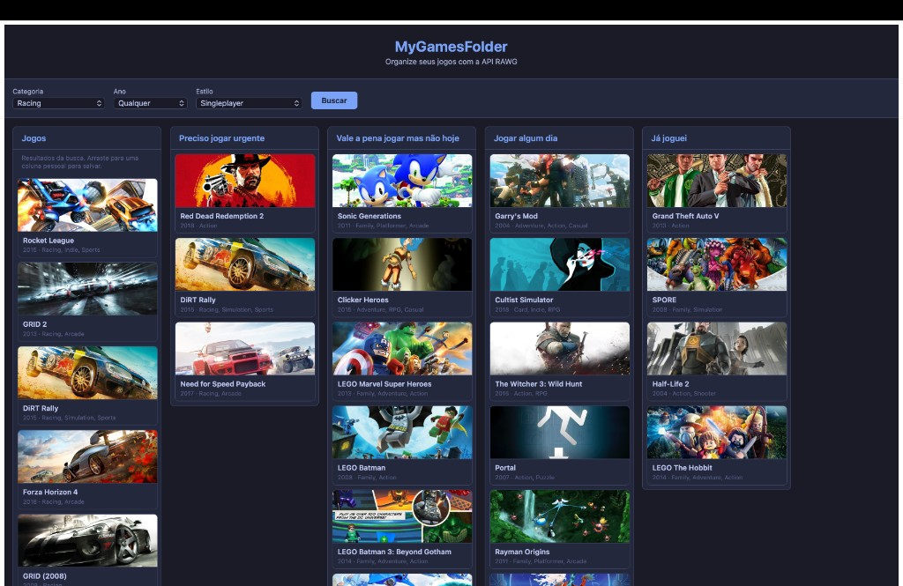
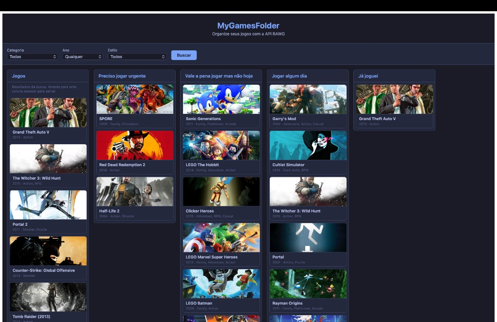

# MyGamesFolder

A Kanban-style board to organize your game backlog using the [RAWG](https://rawg.io) API. Search and filter by category, year, and style; drag games into personal columns and keep everything saved in the browser.

Um quadro no estilo Kanban para organizar sua lista de jogos usando a API [RAWG](https://rawg.io). Busque e filtre por categoria, ano e estilo; arraste jogos para colunas pessoais e mantenha tudo salvo no navegador.

---

## English

### Why this project

I wanted a single place to organize my game backlog: what I need to play soon, what’s worth playing later, and what I’ve already finished. I was inspired by **Kanban boards**: columns for different stages and cards you move between them. So I built MyGamesFolder as a personal “game Kanban”: one column for search results and several columns for my own lists. All data is stored in the browser (no backend), and games are fetched from the RAWG API.

### How the project was made

- **Stack:** [Angular](https://angular.io) 15 with TypeScript. The UI is a single app with one main component, services for API and board state, and Angular CDK for drag-and-drop.
- **Data:** [RAWG API](https://rawg.io) for game search (filters: genre, year, tags). Results are shown in the first column; you drag games into your personal columns.
- **Persistence:** Board state (which games are in which column) is kept in `localStorage` via a small storage service, so it survives reloads and works offline for already loaded data.
- **Layout:** Responsive growth: columns grow downward as you add cards; cards keep a fixed size. The search column is paginated (10 items per page); other columns show all items and the page can scroll vertically.

### Architecture choices and advantages

| Choice | Reason |
|--------|--------|
| Single component for the board | Keeps state and drag-drop logic in one place; no need for routing or complex state sharing for an app of this size. |
| Services for RAWG and board | Clear separation: one service for HTTP and one for board state and column data; easier to test and change later. |
| Angular CDK Drag-Drop | Native support for drag-and-drop between lists, accessibility, and good UX without extra libraries. |
| LocalStorage for persistence | No backend or auth; simple, fast, and works offline for saved data. |
| Pagination only in search column | Search can return many results; pagination keeps the list manageable. Personal columns show all items and grow the page. |
| Fixed-size cards, growing layout | Cards stay readable and consistent; the page grows downward so nothing is squashed. |

### Final result

Search with filters (category, year, style) and a “Buscar” (Search) button. The first column shows results; you drag games into the personal columns.



Kanban columns with fixed-size cards. Columns can grow vertically; each column scrolls when there are many items. Pagination in the first column (10 items per page).



---

## Português

### Por que este projeto

Eu queria um lugar único para organizar minha lista de jogos: o que preciso jogar logo, o que vale a pena jogar depois e o que já zerei. Me inspirei em **quadros Kanban**: colunas para cada etapa e cartões que você move entre elas. Por isso criei o MyGamesFolder como um “Kanban de jogos”: uma coluna com os resultados da busca e várias colunas para as minhas listas. Tudo fica salvo no navegador (sem backend), e os jogos vêm da API da RAWG.

### Como o projeto foi feito

- **Stack:** [Angular](https://angular.io) 15 com TypeScript. A interface é uma única aplicação com um componente principal, serviços para API e estado do quadro, e Angular CDK para arrastar e soltar.
- **Dados:** [API RAWG](https://rawg.io) para buscar jogos (filtros: gênero, ano, tags). Os resultados aparecem na primeira coluna; você arrasta os jogos para as colunas pessoais.
- **Persistência:** O estado do quadro (quais jogos estão em qual coluna) é guardado no `localStorage` por um serviço de armazenamento, então sobrevive a recarregamentos e funciona offline para o que já foi carregado.
- **Layout:** Crescimento responsivo: as colunas crescem para baixo conforme você adiciona cards; os cards mantêm tamanho fixo. A coluna de busca é paginada (10 itens por página); as outras colunas mostram todos os itens e a página rola verticalmente.

### Decisões de arquitetura e vantagens

| Escolha | Motivo |
|--------|--------|
| Um único componente para o quadro | Concentra estado e lógica de drag-and-drop; não exige roteamento nem estado compartilhado complexo para o tamanho do app. |
| Serviços para RAWG e quadro | Separação clara: um serviço para HTTP e outro para estado e colunas; mais fácil de testar e evoluir. |
| Angular CDK Drag-Drop | Suporte nativo a arrastar e soltar entre listas, acessibilidade e boa UX sem bibliotecas extras. |
| LocalStorage para persistência | Sem backend nem autenticação; simples, rápido e funciona offline para os dados salvos. |
| Paginação só na coluna de busca | A busca pode retornar muitos resultados; a paginação mantém a lista usável. As colunas pessoais mostram tudo e a página cresce. |
| Cards de tamanho fixo, layout que cresce | Os cards continuam legíveis e consistentes; a página cresce para baixo e nada fica espremido. |

### Resultado final

Busca com filtros (categoria, ano, estilo) e botão “Buscar”. A primeira coluna exibe os resultados; você arrasta os jogos para as colunas pessoais.


Colunas no estilo Kanban com cards de tamanho fixo. As colunas podem crescer verticalmente; cada coluna rola quando há muitos itens. Paginação na primeira coluna (10 itens por página).


---

## Setup / Configuração

### RAWG API key

1. Create an account at [RAWG](https://rawg.io) and get an API key at [rawg.io/login/?forward=developer](https://rawg.io/login/?forward=developer).
2. Copy `src/environments/environment.example.ts` to `src/environments/environment.ts` and to `src/environments/environment.prod.ts` (or edit the existing files).
3. Replace `YOUR_RAWG_API_KEY` with your key in both files.

Do not commit your API key. RAWG’s free tier allows 20,000 requests/month for personal use.

1. Crie uma conta em [RAWG](https://rawg.io) e obtenha uma API key em [rawg.io/login/?forward=developer](https://rawg.io/login/?forward=developer).
2. Copie `src/environments/environment.example.ts` para `src/environments/environment.ts` e para `src/environments/environment.prod.ts` (ou edite os arquivos existentes).
3. Substitua `YOUR_RAWG_API_KEY` pela sua chave em ambos os arquivos.

Não commite a API key. O plano gratuito da RAWG permite 20.000 requisições/mês para uso pessoal.

### Run the app / Rodar o app

```bash
npm install
ng serve
```

Open [http://localhost:4200/](http://localhost:4200/).  
Acesse [http://localhost:4200/](http://localhost:4200/).

### Build

```bash
ng build
```

Build artifacts go to `dist/`.  
Os arquivos de build ficam em `dist/`.

---

This project was generated with [Angular CLI](https://github.com/angular/angular-cli) version 15.2.11.
